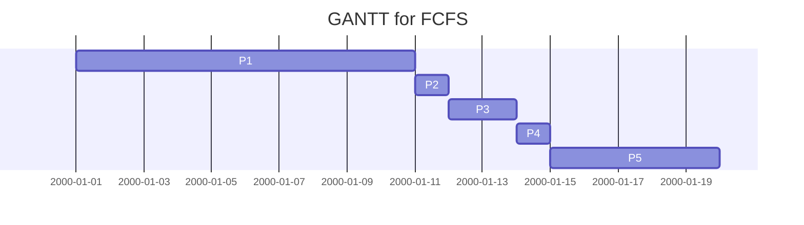
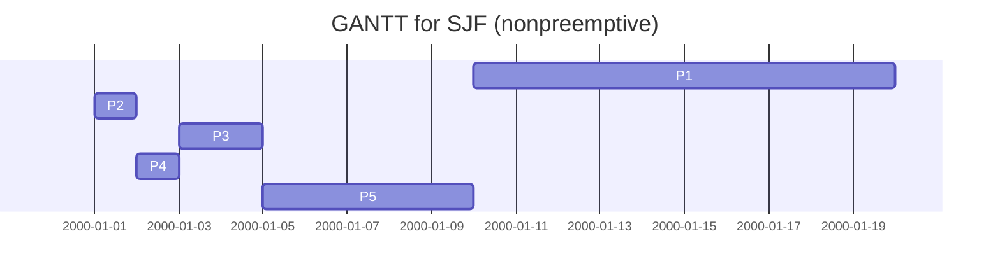
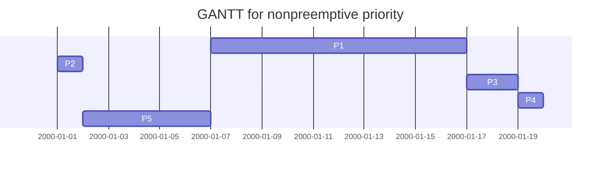

# OS homework for week 8

PB 18000227 艾语晨

### Problem 1

> **Q :**
>
> Consider the deadlock situation that can occur in the dining-philosophers problem when the philosophers obtain the chopsticks one at a time. Discuss how the four necessary conditions for deadlock hold in this setting. Describe a deadlock-free solution, and discuss which necessary conditions are eliminated in your solution

> **A :**

- The four necessary conditions for deadlock are :
  - Mutual Exclusion :
    - When one philosopher is using one chopstick, another one cannot rob the chopstick from him
  - Hold and Wait :
    - Every philosopher is holding a chopstick, while waiting for another chopstick held by another philosopher
  - No Preemption :
    - Only when a philosopher has finished eating, can he put down both his chopsticks.
  - Circular Wait :
    - A philosopher only can use the chopsticks on his side. Every philosopher is holding one chopstick, while waiting the other one, which is exactly held by his neighbour, so every philosopher is holding one chopstick, hungry but not eating.
- Descripition of a deadlock-free solution :
  - When a philosopher starts eating :
    - He should first be hungry :
      - If a philosopher beside him is hungry (but not eating), he is forbidden to be hungry (the former hunger philosopher has turned down 'mutex', so the latter one is blocked).
    - When he *is* hungry :
      - He should ask both sides : **Are you eating ?**
      - If both neighbours are not eating, he can eat
      - If either (or both) neighbours is/are eating, he would be sent to sleep (blocked) by the eater's down(&s[eater])
  - When a philosopher finishes eating :
    - He calls down 'mutex', in order to lock hungry-or-not condition changing
    - He asks his neighbour : **Are you hungry ?**
    - If one neighbour *is* hungry, he should be asleep (blocked) now (due to the eater's `down`), so the eater wakes his neighbour up by calling `up(&s[eater])` (remove blocking state)
- The necessary condition eliminated in the solution is :
  - **Hold and Wait**
  - When a philosopher finds that one chopstick on his side is being used (neighbour eating) or will be (neighbour hungry), he gives up the chance to take chopstick, so he waits without holding resource

### Problem 2

> **Q :** 
>
> Consider the exponential average formula used to predict the length of the next CPU burst. What are the implications of assigning the following values to the parameters used by the algorithm?
>
> a. $\alpha= 0$ and  $\tau_0= 100\ milliseconds$
>
> b. $\alpha= 0.99$ and  $\tau_0= 10\ milliseconds$

> **A :**

The original formula is on page 60 of Ch6.pdf

$$\tau_{n+1}=\alpha t_n + (1 - \alpha) \tau_n$$

> **a :**

The formula now becomes $\tau_{n+1} = \tau_n, \tau_0 = 100ms$ .

- $\alpha = 0$ means that the prediction fully comes from the former predicted value, ignoring *most recent information*.

- $\tau_0 = 100ms$ means that the perdiction begins at 100ms.

> **b :**

The formula now becomes $\tau_{n+1} = 0.99t_n + 0.01\tau_n, \tau_0 = 10ms$ .

- This formula makes prediction mainly depending on *most recent information*, as the $\alpha$ value shows.
- $\tau_0 = 10ms$ means that the perdiction begins at 10ms.

### Problem 3

> **Q :**
>
> Consider the following set of processes, with the length of the CPU burst time given in milliseconds:
>
> | Process | Burst Time | Priority |
> | :-----: | :--------: | :------: |
> |  P~1~   |     10     |    3     |
> |  P~2~   |     1      |    1     |
> |  P~3~   |     2      |    3     |
> |  P~4~   |     1      |    4     |
> |  P~5~   |     5      |    2     |
>
> The processes are assumed to have arrived in the order P1, P2, P3, P4, P5, all at time 0.

> a. Draw four Gantt charts that illustrate the execution of these processes using the following scheduling algorithms: FCFS, SJF (nonpreemptive), nonpreemptive priority (a smaller priority number implies a higher priority), and RR (quantum = 1).
>
> b. What is the turnaround time of each process for each of the scheduling algorithms in part a?
>
> c. What is the waiting time of each process for each of these scheduling algorithms?
>
> d. Which of the algorithms results in the minimum average waiting time (over all processes)?

> **A :**

> > **a :**

**I would use date to show the time, each day represents 1ms, **

FCFS

SJF (nonpreemptive)

nonpreemptive priority

RR （~~这个实在画不出来了，~~我把这4个重新在 Excel 里面画了一遍。。。每一格是 1ms，后面的甘特图同理）

> > **b :** in P1~P5 order

| algorithm |  turnaround time   |
| :-------: | :----------------: |
|   FCFS    | 10, 11, 13, 14, 19 |
|    SJF    |   19, 1, 2, 4, 9   |
| priority  |  16, 1, 17, 19, 6  |
|    RR     |  19, 2, 7, 4, 14   |

> > **c :**

| algorithm |   Waiting time    | Average Waiting Time |
| :-------: | :---------------: | :------------------: |
|   FCFS    | 0, 10, 11, 13, 14 |         9.6          |
|    SJF    |   9, 0, 2, 1, 4   |         3.2          |
| priority  |  6, 0, 16, 17, 1  |          8           |
|    RR     |   9, 1, 5, 3, 9   |         5.4          |

> > **d :**

SJF minimum average waiting time 最小

### Problem 4

> **Q :**
>
> Which of the following scheduling algorithms could result in starvation?
>
> a. First-come, first-served
>
> b. Shortest job first
>
> c. Round robin
>
> d. Priority

> **A :**
>
> $\bf{a\,b\,d}$

### Problem 5

> **Q :**
>
> Consider a system running ten I/O-bound tasks and one CPU-bound task. Assume that the I/O-bound tasks issue an I/O operation once for every millisecond of CPU computing and that each I/O operation takes 10 milliseconds to complete. Also assume that the context-switching overhead is 0.1millisecond and that all processes are long-running tasks. Describe is the CPU utilization for a round-robin scheduler when:
>
> a. The time quantum is 1 millisecond
>
> b. The time quantum is 10 milliseconds

> **A :** We assume that only when all I/O task are in *waiting* condition, can CPU task get into CPU.

> **a:**
>
> A task would face context switching after it has been running for 1ms, whether it's an I/O task or CPU task, so the CPU utilisation is $\frac{1}{1+0.1}=0.909$
>
> **b:**
>
> When CPU resource is allocated to an I/O task, every I/O task would take 1ms, then go to do I/O operations, so the CPU would do context switch. The Gantt chart is like below (draw in Numbers):
>
> 
>
> Therefore the CPU utilisation is $\frac{10+10}{11\cdot 0.1+20}=0.948$.

### Problem 6

> **Q :**
>
> Give an example to illustrate under what circumstances rate-monotonic scheduling is inferior to earliest-deadline-first scheduling in meeting the deadlines associated with processes?

> **A :**
>
> > Example : There are total *two* processes, named P1 & P2. Their arrival gap & tasking time are shown as below (we assume that both P1 & P2 arrived at 0ms, in the order of 1,2:
> >
> > P1 : $d_1(gap) = 50ms, t_1(task) = 25ms$
> >
> > P2 : $d_2(gap)=80ms,t_2(task)=35ms$
>
> 
>
> > Rate-monotonic scheduling :
> >
> > The Gantt chart is like this (drawn in OneNote) :
> >
> > 
> >
> > So when the deadline of P2 comes, the actual task time of P2 is $25+5=30<35$ , thus P2's task is not completed before its DDL.
>
> 
>
> > However, the *earlist-deadline-first* scheduling can make sure that both processes can finish their task before ddl.
>
> 
>
> > Earlist-deadline-first scheduling :
> >
> > The Gantt chart is like this (drawn in OneNote) :
> >
> > 
> >
> > (*When time reaches 50ms, the ddl of P1 is at 100ms, while that of P2 is at 80ms, therefore P2 is to be done*)
> >
> > So P1 & P2 can both done their tasks.
>
> 
>
> > So we say that under this circumstance rate-monotonic scheduling is inferior to earliest-deadline-first scheduling in meeting the deadlines associated with processes.