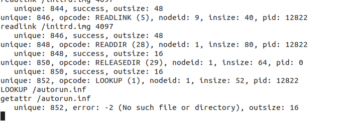

# OS lab 4 summary

by Tobiichi Origami

## 任务一

### 熟悉FUSE的使用

#### 关于界面看起来死掉了

在执行 `./fusexmp -d fuse_test_dir` 时，会出现这个界面

这个不是啥错的……继续往后做吧

### 熟悉FAT文件系统

#### `path_split()`

> 截断过长的文件名输入（8+3）

`paths` 是二维数组，即 (8+3)*Byte 的二进制字符类型矩阵

总路径长度用string函数来获得

关于分开写路径到paths：

- 首先：当前目录、上一级目录这两个分开考虑
- 需要转换大小写
- 需要给文件名和扩展名一个定位指针（用于确定文件名录入位置，即哪一个‘/’后面是文件名而不是目录名，和确定截断）